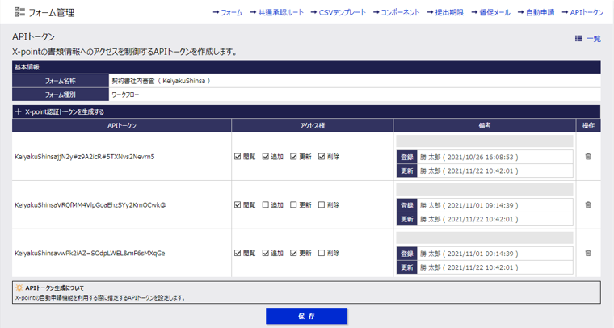

# REST API利用ガイド

* Table of Content
{:toc}

## 1. REST APIの概要

X-pointの各種機能をブラウザ、スマートデバイス・アプリに表示される画面から利用するのではなく、httpsプロトコルを介した通信で画面を介さず直接利用することを目的とする機能です。

### 主な機能

1. 書類の提出
2. 書類のワークフロー操作／状態の取得
3. 書類内容の取得（コメント含む）
4. 添付ファイルの操作
5. 書類PDFの取得

***注意事項***

* X-pointのブラウザ、スマートデバイスにおける書類ワークフロー操作(書類の提出、承認、保留、差し戻し等)に連動してAPI をリクエストする場合は、書類 Webhook 機能を利用してフォーム毎に指定を行います。
* REST API より書類のワークフロー操作(書類の提出、承認、保留、差し戻し等)を行った場合も、フォームに指定されている書類 Webhook 機能は動作します。
* REST API のリクエストにより X-point サーバーに一定の負荷がかかります。REST API のリクエストが多くなることでX-point の応答速度等に影響を与える場合があります。

## 2. 共通機能

### 2.1. 基本項目

書類編集・承認操作の REST API の実行ではリクエストを X-point に送信する場合、ログイン ID による認証を必要とする方法、予め登録されたトークンコードを使用する方法の 2 種類があります。接続に使用する情報は http ヘッダに指定する必要があります。
ヘッダに、認証情報、トークンコードいずれかの指定が無い REST API 実行は必ずエラー応答になります。

#### 項目

| 項目 | ヘッダ名 | 説明 |
|:--|:--|:--|
| トークン情報 | X-ATLED-Generic-API-Token | ドメインコード、ユーザコード、管理者サイト「ドメイン管理」または「フォーム管理」で生成したトークンコードを`:`で連結して、Base64エンコードした情報を指定する。 |
| 認証情報 | Authorization | OAuth2認証のアクセストークンを指定する。 |

レスポンスには送信元がX-pointであることを示す以下のhttpヘッダが設定されます。

| ヘッダ名 | 設定値 |
|:--|:--|
| X-point-API-Sender | X-point [{ドメインCD}] |

***注意事項***

* トークン指定で REST API を利用する場合に限り、フォーム・書類に指定されたアクセス権に加え、トークン毎に指定する権限（閲覧、追加、更新、削除）が書類データを操作する際に追加指定されます。
OAuth2 認証のアクセストークンを使用する場合は、フォーム・書類に指定されたアクセス権限で各種機能が動作します。

### 2.2. APIトークン

API トークンを利用する場合、OAuth2 認証のようにユーザー毎の個別認証を行わずに、トークン情報で REST API を実行することができます。
ユーザーID 毎の認証を行わない為、REST API 実行時には実行ユーザー（誰が申請したか、だれが承認したかなど）を記録するためユーザーコードとドメインコードが必要になります。
トークンコードはデータベースへの追加、更新、削除、閲覧の４種類の対する許可を設定する事ができます。REST API の利用者が許可範囲を超えて操作してしまう事を防止する、REST API を実行するプログラムが漏洩する等した場合に、トークンコードに指定された許可を取り消す事でデータの漏洩・破損を防ぐ事ができます。

#### ヘッダ設定形式

```text
X-ATLED-Generic-API-Token: ******************
```

#### トークンの構成

トークンコードはX-pointサーバー上で生成される全長40文字のランダム文字列です。

#### トークンの種類

トークンにはフォーム毎のトークンとドメイン毎のトークンの2種類あります。

| 種類 | 生成画面 | 生成条件 | トークン有効範囲 |
|:--|:--|:--|:--|
|フォーム毎のトークン | フォーム管理＞APIトークン | トークンを生成したいフォームの自動申請設定登録が必要。 | トークンに紐づく自動申請を設定したフォームの書類が操作可能。トークンに紐づかない他フォームの書類は操作できません。 |
| ドメイン毎のトークン | ドメイン管理＞認証情報 | - | ドメイン内の全ての書類が操作可能。|

※ 自動申請設定の設定手順等は「管理者機能マニュアル ~自動申請~」を確認してください。

#### トークン管理

* 有効な API トークンはフォーム毎のトークン、ドメイン毎のトークン共に 10 個の生成が可能です。
* API トークンはドメインごとに管理可能です。
* トークンごとに REST API の利用制限を実施します。（閲覧権限、追加権限、更新権限、削除権限）

#### トークンでREST APIを実行する場合

HTTP ヘッダ`X-ATLED-Generic-API-Token`に次の手順で生成したトークン情報をセットします。

1. ドメインコード、ユーザコード、トークンコードを`:`で挟み連結する

   `{ドメインコード} + ":" + {ユーザコード} + ":" + {トークンコード}`
2. 連結した文字列全体をBase64でエンコードする

***注意事項***

* OAuth2 認証とトークン情報をどちらも指定した場合、認証したユーザではなくユーザコードで指定されたユーザで REST API が実行されます。

#### トークン生成方法

##### フォーム毎のトークン生成方法

1. X-point管理サイトのフォーム管理画面を開き、`APIトークン`リンクを押下します。

   

2. APIトークン・設定フォーム一覧画面でAPIトークンを生成したいフォーム名称リンクを押下します。

   

   ***注意事項***
   * フォーム毎のトークンを生成するには自動申請設定の登録が必要です。自動申請設定を登録していないフォームは API トークン・設定フォーム一覧画面に一覧表示されず、フォーム毎のトークンを生成できません。
3. APIトークン画面で`＋X-point認証トークンを生成する`リンクを押下してAPIトークンを生成します。

   API トークン画面ではトークンの生成、アクセス権の付与、トークンの削除が可能です。API トークンの生成、アクセス権の編集完了後は`保存`ボタンを押下して API トークン情報を保存します。API トークンはフォーム毎に最大 10 トークン生成可能です。

   
